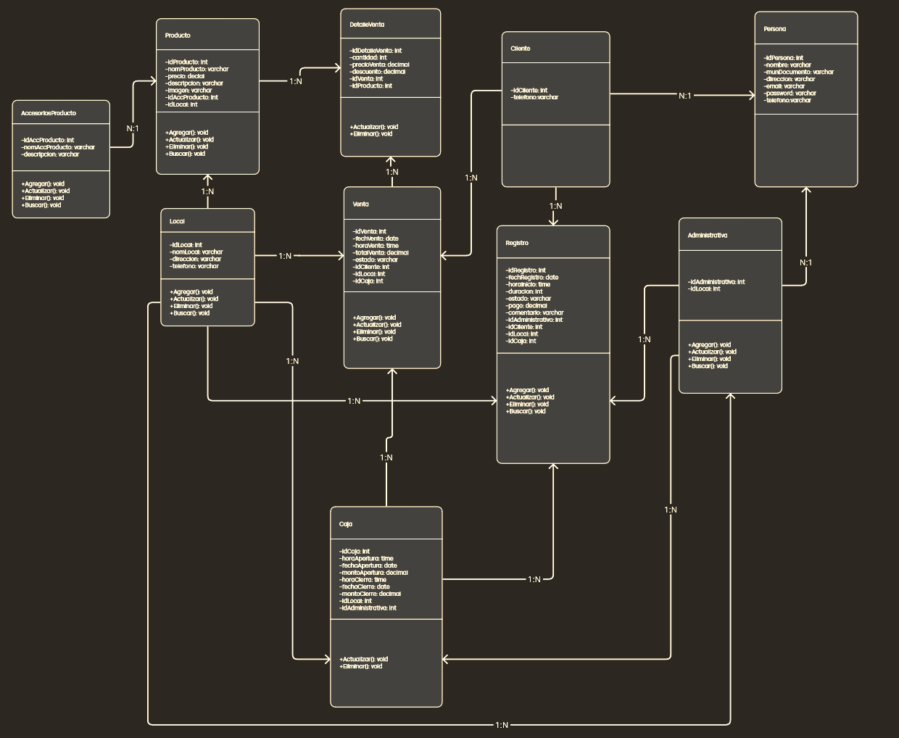

# Crear entorno Virtual 

```cmd
virtualenv -p python venv
```

# Activar entorno Virtual 

```cmd
.\venv\Scripts\activate
```

# Creacion del Archivo **requirements.txt**

```cmd
pip freeze > "requirements.txt"
```


# Instlacion del Archivo **requirements.txt**

```cmd
pip install -r .\requirements.txt
```
## CREAR PROYETO INICIAL EN DJANGO

```cmd
django-admin startproject core .  
```

## Para crear nuevas Apps
```
python ../manage.py startapp "nombre_app"
```
## EJECUTAR PROGRAMA
```
python .\manage.py runserver 127.0.0.1:8000     
```
## Para generar la carpeta static
```
python manage.py collectstatic
```

## Actualizacion 
```
python manage.py makemigrations
```
```
python manage.py migrate
```

## Para crear el super Usuario
```
python manage.py createsuperuser
```

## Diagrama

