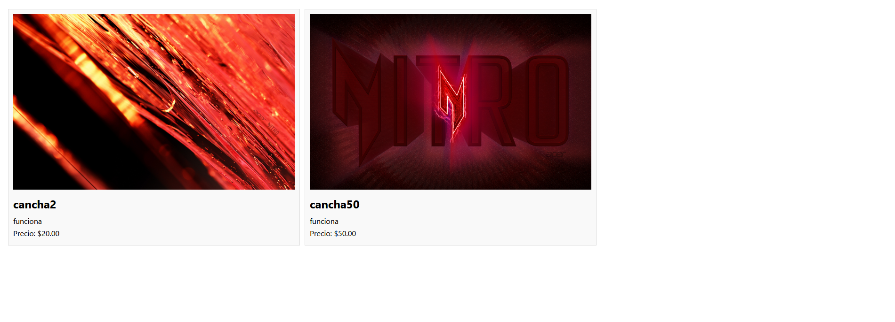
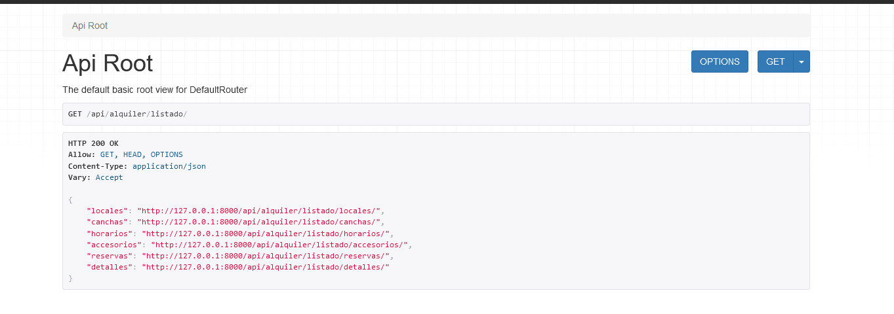

# Reactjs + Django  `Canchitas.com`

Sistema de Alquiler de Canchas

# Integrantes

- Aron Josue Hurtado Cruz
- Luis Fernando Luque Nieto
- Kevin Joel Linares Salinas
- Elmerson Ramith Portugal Carpio

### Curso `Ingeniería Web` 

### Semestre  `ING-VII`


# Comandos de Instalacion Django

Requisitos previos, para la creacion de un entorno virtual en python

### Windows
- virtualenv
```
pip install virtualenv
```

### Ubuntu/Debian
- pip3
```
sudo apt install python3-pip
```

- virtualenv
```
pip3 install virtualenv
```

Creacion del entorno virtual en los sistemas operativos:

### GNU Linux
- Creacion del entorno virual `venv`
```
virtualenv venv -p python3
```
- Activacion del entorno virtual `venv`
```
source venv/bin/activate
```
- Desactivacion del entorno virtual `venv`
```
deactivate
```

### Windows
- Creacion del entorno virual `venv`
```
python -m virtualenv venv
```
- Activacion del entorno virtual `venv`
```
.\venv\Scripts\activate
```
- Desactivacion del entorno virtual `venv`
```
deactivate
```

##  Instalacion el archivo `requirements.txt` en un entorno virtual
```
pip install -r ".\requirements.txt"
```

## Comandos de Instalacion React

- Instalacion de Paquetes
```
npm i
```

## Comandos para inicializar React

```npm start```


## Comandos para Inicializar Django


```
python manage.py makemigrations 
```
```
python manage.py migrate 
```
```
python .\manage.py runserver 127.0.0.1:8000 
```

# Despligue en Reactjs + Django 

```
npm run build
```
```
python .\manage.py runserver 127.0.0.1:8000 
```

# Ramas de Desarrollo

- Rama `main` -> Esta es la rama principal
- Rama `desarrollo`
- Rama `pruebas`


# Ejecucion

## Frontend



## Backend





# Referencias

https://github.com/Emerson-Portugal/AlquilerCanchas
